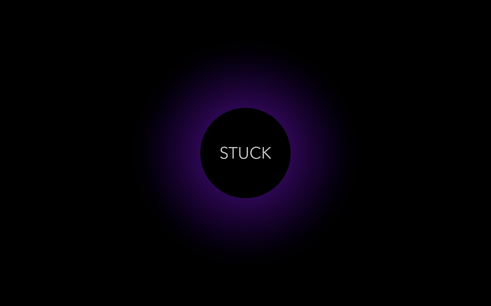
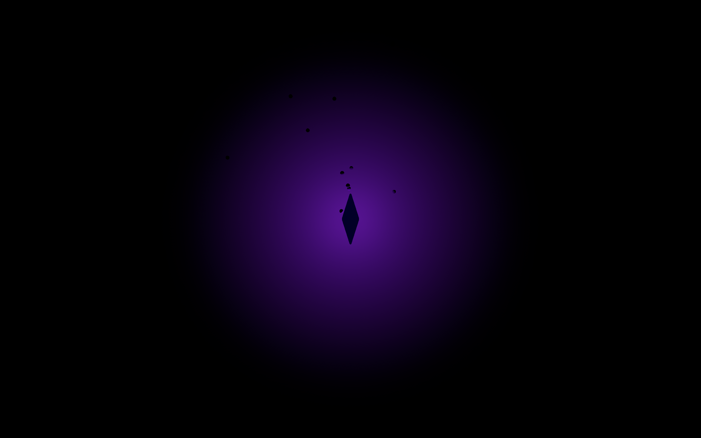

# STUCK

[Play on itch.io](https://omarcompiled.itch.io/stuck)

---

**About the Game:**  
> A **fast-paced horror roguelite** where you relive childhood nightmares, fight shadows, and collect memory shards to survive.

STUCK is a looping nightmare roguelite where speed and nerves matter.  
You play as **James**, trapped between life and a coma, reliving childhood trauma while hostile shadows stalk every corridor.  
Defeat shadows, collect **memory shards**, and unlock upgrades to survive the next run.  
Each attempt brings you closer to the truth… or deeper into the dark.

---

## Backstory
James’s body lies broken in a hospital bed, his mind trapped in endless nightmares that fold and repeat.  
Each nightmare reflects a buried fear or trauma from his childhood.  
Fragments of memory appear as shards, battered pieces of who he was.  
The shadows that stalk him are those traumas given form. Only by confronting them and gathering memory can James hope to wake.

---

## Gameplay

### How a Run Works
- Enter a nightmare shaped by phobias and past trauma. Rooms are randomly assembled to keep each attempt fresh.  
- Face waves of aggressive shadows that hunt you relentlessly.  
- Collect **memory shards** dropped by enemies.  
- Spend shards to unlock permanent upgrades for the next run.  

### Core Loop
1. Start a run  
2. Fight and evade shadows  
3. Collect shards  
4. Defeat all shadows  
5. Spend shards on permanent upgrades  
6. Repeat  

The first nightmare is **Nyctophobia**, a level of oppressive darkness where shadows close in and your vision warps as your sanity fades.

---

## Key Features
- **Run After Run design** where shards fuel upgrades for the next attempt.  
- **Short, high-tension runs** that reward momentum and quick movement.  
- **Nightmares built on fear** with levels inspired by phobias and childhood trauma.  
- **Procedurally varied rooms** that remix every nightmare for replayability.  
- **Atmospheric audio and minimal HUD** for immersion in the terror.  
- **Haunting visuals** that grow darker as your sanity breaks down.  

---

## Controls
- **W / A / S / D** Move  
- **E** Dash  
- **Shift** Sprint  
- **Left Mouse** Flashlight  
- **Space** Jump  
- **Q** Pause  
- **ESC** Exit to main menu  

---

## Tips
- Your sanity drains over time. Kill shadows to restore it.  
- Look for healing rooms. They give back some sanity when you are low.  
- Dodge dashing shadows. They hit harder than the rest.  
- Collect shards whenever possible. They make you stronger for the next run.  

---

## Screenshots

  
  
  
  

---

## Installation
1. Download the latest release:  
   - `stuck_windows.zip` (Windows)  
   - `stuck_linux.zip` (Linux)  
2. Unzip the file.  
3. Run the executable:  
   - `Stuck.exe` on Windows  
   - `Stuck.x86_64` on Linux  

---

## Feedback
We’d love to hear your thoughts.  
- Leave feedback on the [itch.io page](https://omarcompiled.itch.io/stuck)  
- Or open an issue or discussion here on GitHub.  

---

## Credits
- Created by [**OmarCompiled**](https://github.com/OmarCompiled) and [**Lethargy2718**](https://github.com/Lethargy2718)  
- Built for the **Game Development competition at IEEE Victoris 4.0**
